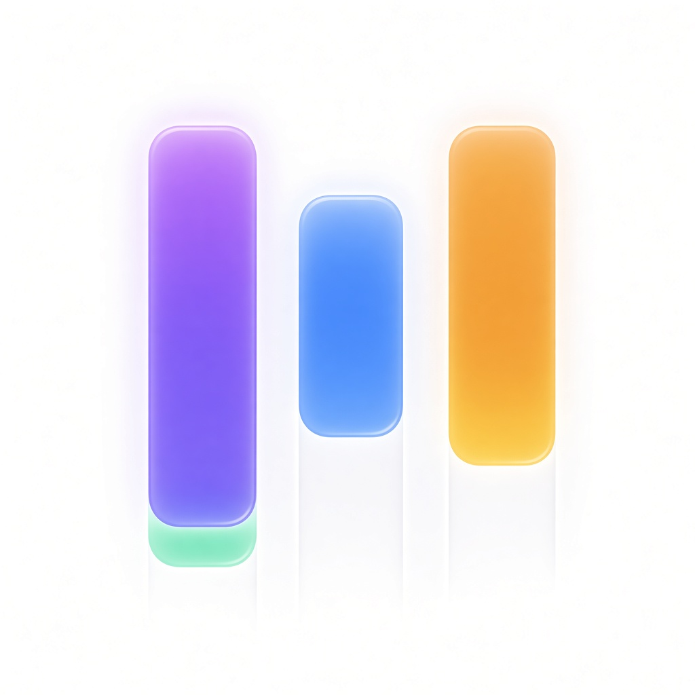

# Release notes

  

## 1.0.0 — 22 August 2026

First public release of Solo Scrum: a local desktop Scrum board for one developer.

### What’s in this release

- Glass-style Kanban board with four columns: **New**, **On Progress**, **Tested**, **Done**
- Projects with sequential IDs (`PRJ-1` …) — create, rename, delete
- User stories with sequential IDs (`US-1` …)
- Story composer: title, description / acceptance criteria, priority, Fibonacci points, project, and starting column
- Drag-and-drop between columns, plus reorder within a column
- Card menu to edit, move, or delete a story
- Confirm dialogs for destructive deletes
- Header counts for projects, stories, and done work
- Native-feeling macOS chrome (hidden inset title bar)
- PDF board report: landscape Letter snapshot with column overview, project list, and full story details
- Local JSON persistence — nothing leaves the machine

### Notes

- Stories must belong to a project. Create a project first, or add one from the story modal.
- Deleting a project does not delete its stories; they stay on the board, unassigned.
- There is no packaged installer in this release. Run from source with `npm install` and `npm run dev`, or `npm run build` then `npm run preview`.
- The board file lives in the app’s user-data folder as `solo-scrum.json`.

### Known limits

- Single local workspace (no multi-profile or import/export of the JSON file from the UI)
- Light theme only
- No packaged `.dmg` / `.exe` / `.AppImage` yet
